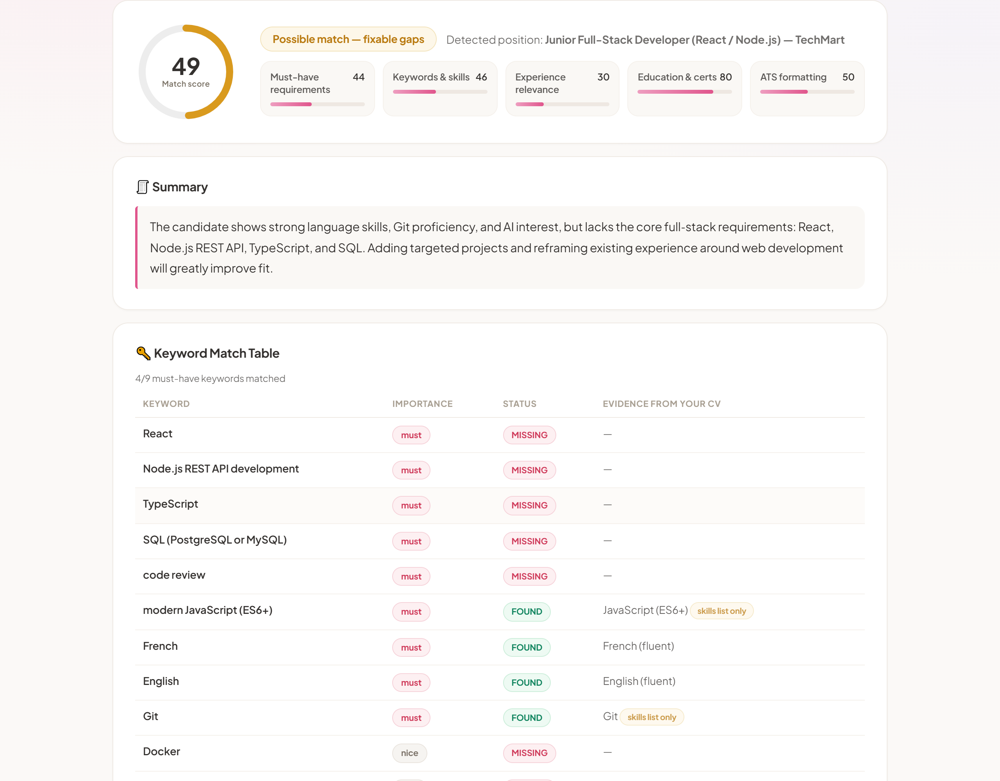

<div align="center">

# 🎯 CV Lens

### See your CV like an ATS does — before the ATS does.

**Paste your CV + a job posting. Get the exact keywords you're missing, what to add, and what to cut — with proof quoted from your own CV.**

[](https://hajar-benhadj.github.io/ats-cv-checker/)


**English · Français · العربية (RTL)** · works on mobile · free forever

</div>

---

## 💡 The problem

Most companies run CVs through an **ATS (Applicant Tracking System)** before a human ever sees them. One missing keyword — *TypeScript*, *PostgreSQL*, *anglais courant* — and a qualified candidate is silently filtered out. People get rejected by software for formatting they never knew was wrong.

**CV Lens shows you exactly what that filter sees.**

## ✨ What you get

| | |
|---|---|
| 🧾 **Evidence-based keyword table** | Every must-have and nice-to-have from the posting: **FOUND / PARTIAL / MISSING** — each with a short quote from your CV (or an honest "no evidence") |
| 📍 **Keyword placement** | For each keyword: does it live in your **Experience** section or only in your skills list? Real ATS parsers treat these very differently. Synonym-aware (JS = JavaScript, CI/CD = Continuous Integration…) |
| 🎯 **Must-haves first** | Required keywords are separated from nice-to-haves and sorted worst-first, with an "X/Y must-have keywords matched" summary |
| 📊 **Match score + 5 sub-scores** | Must-haves · keywords · experience · education · ATS formatting — with an honest verdict, not flattery |
| 🔥 **Before / after tracking** | Each analysis is compared with your previous one on the same device — see your score climb |
| ✍️ **AI bullet rewrites** | One click rewrites your 4–6 weakest bullets using the job's keywords — grounded in your CV only, unknown numbers stay as `[X%]` placeholders, never invented |
| ✅ **Add** | Concrete additions with suggested wording — always phrased *"only if true for you"* |
| ✏️ **Improve** | Before → after rewrites of your actual lines |
| ❌ **Remove** | What's hurting you for *this* job specifically |
| ⚡ **Rule-based ATS checks** | Contact info, section headings, action verbs, quantified results, single-column layout, dates, **employment gaps**, verb variety, overlong bullets, **images and repeating headers/footers detected inside the PDF** — deterministic facts, not AI guesses |
| 🔗 **Smart job-link handling** | Paste a job URL and press Analyze — it fetches the posting automatically (server-side, no CORS walls) |
| 📄 **Client-side document parsing** | PDF / DOCX / TXT read locally with pdf.js + mammoth.js — the file never leaves your device |
| 🕘 **History** | Last 10 analyses kept in localStorage — reopen any past report (stays on your device) |
| 📋 **Export** | Copy the full report, **download a PDF report** (jsPDF), print, or **share a score card image** for social media |



## 🔒 Privacy & security

- **Your CV file never leaves your browser** — parsing happens locally; only plain text you submit goes to the analysis API
- **Nothing is stored or logged** — no accounts, no database, no tracking
- **No keys in the client** — the AI key lives only in a serverless function (Vercel env secret), never in shipped JavaScript
- **Rate-limited API** (10 analyses / hour / IP) to prevent abuse

## ⚙️ How it works

```
 Browser (GitHub Pages)                  Serverless (Vercel, free tier)
 ┌───────────────────────────┐           ┌─────────────────────────────┐
 │ PDF/DOCX parsed locally   │  POST     │ rate limit → OpenRouter AI  │
 │ rule-based ATS checks     │ ────────► │ (key = env secret, never    │
 │ render scores & evidence  │ ◄──────── │  shipped to clients)        │
 └───────────────────────────┘  JSON     │ JSON validated + auto-retry │
                                         └─────────────────────────────┘
```

Hybrid accuracy: **deterministic rules in the browser** + a **strict evidence-based AI prompt** (temperature 0.2, JSON schema, model fallback chain) that is explicitly forbidden from inventing experience.

## 🛠 Tech stack

**Zero-framework vanilla JS** · Tailwind (CDN) · pdf.js · mammoth.js · jsPDF · Vercel serverless functions · OpenRouter AI · EN/FR/AR i18n (RTL)

## 🚀 Run it locally

```bash
git clone https://github.com/hajar-benhadj/ats-cv-checker.git
cd ats-cv-checker
python -m http.server 8080   # open http://localhost:8080
```

The public API endpoint is already live; to self-host the analysis too, deploy the `api/` functions to your own Vercel and set `OPENROUTER_KEY`.

## 📄 License

MIT © Hajar Benhadj — use it, learn from it, build on it.
